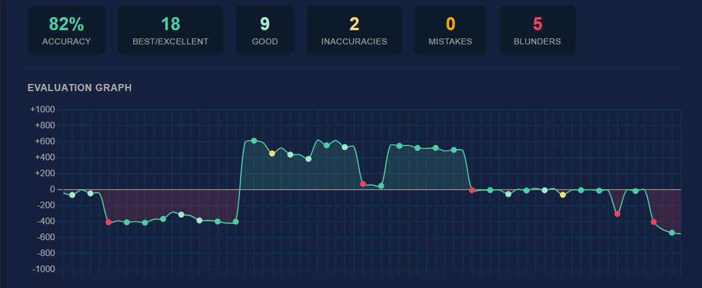
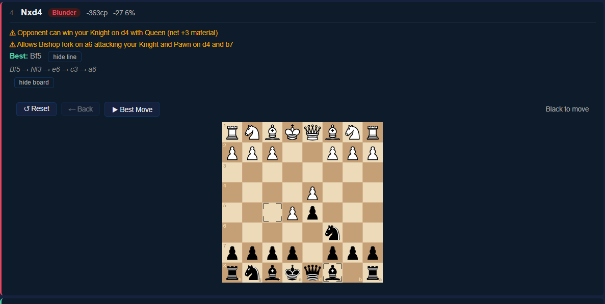

# Chess Analyzer

A full-stack web app that reviews your Chess.com games with the Stockfish engine. Pull your games by username, get a move-by-move evaluation, see where the game turned, and replay positions on an interactive board.

**Live demo:** https://chess-analyzer-p307.onrender.com
*(Free hosting: the first load after a quiet period can take ~30 seconds to wake up, and analysis runs on a small shared CPU, so it's slower than running locally.)*


 


---

## Features

- **Flexible game search**: load a whole month, the last N games, or the last N games of a chosen month, straight from the Chess.com Public API
- **Move classification**: every move is evaluated by Stockfish at configurable depth (default 15) and graded Best, Excellent, Good, Inaccuracy, Mistake or Blunder using win-percentage loss from a sigmoid model
- **Tactical hints**: a custom Static Exchange Evaluation (SEE) routine and a back-rank threat detector turn flagged moves into plain-English explanations
- **Opening detection**: shows the opening for each game
- **Evaluation graph**: per-move chart of how the position shifted across the game
- **Interactive board replay**: step through the game, branch off at any move, and play on with Stockfish answering
- **Redis caching**: results are cached for 2 hours, keyed by `username:year:month:game_index`; the app still works without Redis, it just re-runs the engine
- **State survives a refresh**: your search mode and results are restored from the browser session

## Performance

On a 23-move game at depth 15 (local Docker), a first analysis took about **9.7 s**, and a repeat request served from the Redis cache took about **28 ms** (roughly 350x faster). The deployed demo runs on a small free instance, so its cold analysis is slower than this.

---

## Run with Docker (easiest)

You only need Docker. The image bundles Stockfish, the Flask API and the built Vue frontend, and Compose starts Redis alongside it.

```bash
git clone https://github.com/AidenTG25/chess-analyzer.git
cd chess-analyzer
docker compose up --build
```

Then open http://localhost:5000.

## Run locally (development)

**Prerequisites:** Python 3.10+, Node.js 18+, [Stockfish](https://stockfishchess.org/download/), and optionally Redis.

### 1. Backend

```bash
cd backend
python -m venv venv

# Windows
venv\Scripts\activate
# macOS/Linux
source venv/bin/activate

pip install -r requirements.txt
cp .env.example .env     # then set STOCKFISH_PATH to your Stockfish binary
```

`.env`:

```
STOCKFISH_PATH=C:/path/to/stockfish.exe   # Windows
# STOCKFISH_PATH=/usr/games/stockfish     # Linux
REDIS_URL=redis://localhost:6379
```

```bash
python app.py            # runs on http://localhost:5000
```

### 2. Frontend

In a new terminal:

```bash
cd frontend
npm install
npm run copy-assets      # copies the chessboard CSS/pieces into public/ (Windows script)
npm run dev              # runs on http://localhost:5173
```

In development the frontend calls the API at `http://localhost:5000` (set in `frontend/.env.development`). In the Docker image, Flask serves the built frontend itself, so no URL is needed.

---

## API

All endpoints take and return JSON.

| Method | Endpoint | Body | Description |
|--------|----------|------|-------------|
| `GET` | `/health` | none | Health check |
| `POST` | `/games` | `username`, `year`, `month` | List a user's games for a month |
| `POST` | `/analyze` | `username`, `year`, `month`, `mode` (`single` / `last_n` / `all`), plus `index`, `n`, `depth` | Run Stockfish analysis on the selected game(s) |
| `POST` | `/bestmove` | `fen` | Best move for a position |

## Project structure

```
chess-analyzer/
├── Dockerfile              # multi-stage build: Vue -> Flask + Stockfish
├── docker-compose.yml      # app + Redis
├── backend/
│   ├── app.py              # Flask app and routes
│   ├── analyzer.py         # Stockfish integration, move classification, SEE
│   ├── cache.py            # Redis caching layer (fails soft without Redis)
│   ├── chess_api.py        # Chess.com API client
│   └── .env.example
├── frontend/
│   └── src/
│       ├── App.vue
│       └── components/     # GameSearch, GameList, ChessBoard, EvalGraph, MoveList, AnalysisSummary
└── scripts/
    └── bench_analyze.py    # cold vs cached timing for /analyze
```

## Tech stack

**Backend:** Python, Flask, Gunicorn, python-chess, Stockfish, Redis

**Frontend:** Vue 3, Vite, Axios, cm-chessboard, chess.js, Chart.js

**Infra:** Docker, Docker Compose, Render (app), Upstash (Redis)

## Notes

- Redis is optional. Without it, repeated analysis of the same game re-runs the engine each time.
- Chess.com's public API rate-limits requests; that is a platform limit, not a project one.
- The project started as a CLI tool before being rebuilt as a full-stack web app.
